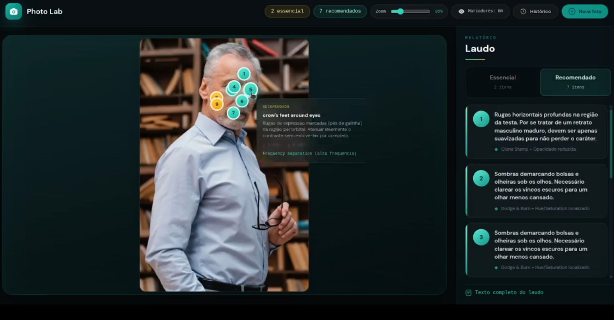

# Photo Lab — Retoque com IA

Aplicação web para **análise automática de pele** e **laudo técnico de retoque fotográfico**. O usuário envia uma foto, e o sistema gera um relatório estruturado (itens essenciais e recomendados), localiza pontos na imagem com IA (Moondream/Fal AI) e exibe marcadores interativos com tooltips.


---



## Índice

- [Funcionalidades](#funcionalidades)
- [Stack tecnológica](#stack-tecnológica)
- [Pré-requisitos](#pré-requisitos)
- [Configuração](#configuração)
- [Execução](#execução)
- [Arquitetura](#arquitetura)
- [IA (Model/LLM)](#ia-modelllm)
- [API](#api)
- [Estrutura do projeto](#estrutura-do-projeto)
- [Variáveis de ambiente](#variáveis-de-ambiente)
- [Licença](#licença)

---

## Funcionalidades

- **Upload de foto** — Arraste ou selecione uma imagem (JPG, PNG, WebP).
- **Laudo técnico** — Análise de pele por zonas (testa, olhos, maçãs do rosto, boca, pescoço) com priorização em **essencial** e **recomendado**.
- **Marcadores na imagem** — Pontos localizados por IA (Moondream) com descrição e técnica sugerida; tooltips ao passar o mouse.
- **Processamento assíncrono** — Upload imediato + job em background (Redis/RQ); o frontend faz polling do status até concluir.
- **Histórico** — Listagem de análises anteriores com thumbnail, data e preview; reabertura de laudos salvos.

---

## Stack tecnológica

| Camada        | Tecnologia |
|---------------|------------|
| **Backend**   | Python 3.12, FastAPI, Uvicorn |
| **Frontend**  | HTML, CSS (Tailwind), JavaScript vanilla |
| **IA – Agente** | Agno + OpenRouter (modelo com visão, ex.: Gemini 2.0 Flash) |
| **IA – Pontos (interno)** | Fal AI — Moondream 3 **point** (`fal-ai/moondream3-preview/point`), chamado pelo serviço do agente |
| **Fila**      | Redis, RQ (Redis Queue) |
| **Servir UI** | Nginx (Alpine) |
| **Orquestração** | Docker Compose |

---

## Pré-requisitos

- **Docker** e **Docker Compose** (recomendado), ou
- **Python 3.12+**, **Redis** e **Node** (opcional, só para rodar frontend em dev).

---

## Configuração

1. **Clone o repositório**

   ```bash
   git clone git@github.com:williamreis/photo-lab.git
   cd photo-lab
   ```

2. **Crie o arquivo de ambiente**

   ```bash
   cp .env.example .env
   ```

3. **Defina as chaves obrigatórias no `.env`**

   - **FAL_KEY** — API key da [Fal AI](https://fal.ai) (obrigatória para localização de pontos e detecção).
   - **OPENROUTER_API_KEY** — API key do [OpenRouter](https://openrouter.ai) (obrigatória para o agente de análise de pele).

   Opcionalmente:

   - **AGENT_MODEL** — Modelo com visão no OpenRouter (padrão: `google/gemini-2.0-flash`).
   - **REDIS_URL** — URL do Redis (padrão em Docker: `redis://redis:6379/0`).
   - **PORT** / **FRONTEND_PORT** — Portas da API (8000) e do frontend (8101).

   Exemplo mínimo:

   ```env
   FAL_KEY=sua-chave-fal
   OPENROUTER_API_KEY=sua-chave-openrouter
   ```

---

## Execução

### Com Docker Compose (recomendado)

Na raiz do projeto:

```bash
docker compose up --build
```

- **API:** http://localhost:8000  
- **Documentação da API:** http://localhost:8000/docs  
- **Frontend (Photo Lab):** http://localhost:8101  

Serviços: `redis`, `api`, `worker`, `frontend`. O worker processa os jobs de análise em background.

### Sem Docker (desenvolvimento)

1. **Redis em execução** (ex.: `redis-server` na porta 6379).

2. **Backend:**

   ```bash
   cd backend
   pip install -r ../requirements.txt
   export $(grep -v '^#' ../.env | xargs)
   uvicorn main:app --reload --host 0.0.0.0 --port 8000
   ```

3. **Worker** (em outro terminal):

   ```bash
   cd backend
   export $(grep -v '^#' ../.env | xargs)
   python worker.py
   ```

4. **Frontend:** sirva a pasta `frontend/` (ex.: com um servidor estático ou apontando o Nginx para ela). Em produção com Docker, o Nginx faz proxy para a API; em dev local, ajuste a base URL no frontend se a API estiver em outra origem.

---

## Arquitetura

```
┌─────────────┐     ┌─────────────┐     ┌─────────────┐
│   Nginx     │────▶│   FastAPI   │────▶│   Redis     │
│  (frontend) │     │   (API)     │     │   (fila)    │
└─────────────┘     └──────┬──────┘     └──────┬──────┘
       │                   │                   │
       │                   │                   ▼
       │                   │            ┌─────────────┐
       │                   │            │   Worker    │
       │                   │            │   (RQ)      │
       │                   │            └──────┬──────┘
       │                   │                   │
       │                   │                   ▼
       │                   │            OpenRouter (laudo) + Fal Moondream /point
       │                   │            (coordenadas; sem rotas HTTP /point ou /detect)
       ▼                   ▼
   Uploads estáticos   /api/v1/*  (agent, history, jobs)
```

- O **frontend** envia a imagem para `/api/v1/agent/analyze/persist_async`.
- A **API** persiste o arquivo, enfileira um job no Redis e devolve `job_id` e `history_id`.
- O **worker** executa o job: chama o agente (OpenRouter) para o laudo e o Fal AI (Moondream) para os pontos; grava o resultado no histórico.
- O **frontend** faz polling em `/api/v1/jobs/{job_id}` e, ao concluir, carrega o laudo e os marcadores a partir do histórico.

---

## IA (Model/LLM)

Esta aplicação usa **dois tipos de modelos**: um **LLM com visão** (OpenRouter) para escrever o laudo e definir **queries de localização**, e o endpoint **Moondream 3 / point** da **Fal AI**, chamado **internamente** pelo backend, para obter **coordenadas (x, y)** na imagem.

**Importante:** nesta versão do repositório **não existem** rotas HTTP públicas `/api/v1/point/*` nem `/api/v1/detect/*`. O modelo **detect** (bounding boxes) está referenciado em `config.py` (`FAL_MODEL_DETECT`), mas **não** está exposto como API REST — só o fluxo do **agente** usa o **point** via `fal-client`.

Na prática, o fluxo fica assim:
- O LLM (via OpenRouter) lê a foto e produz um **relatório estruturado** de retoque.
- No final do relatório, ele inclui uma seção **`## LOCALIZAÇÃO`** com frases em inglês (uma por item) que o backend usa como **`point_queries`**.
- Para cada `point_query`, o backend chama a Fal **`/point`** e recebe coordenadas **normalizadas (0–1)**.
- Por fim, o backend monta os **`markers`** (tooltip) combinando o item do relatório (descrição/técnica/prioridade) com as coordenadas retornadas.


### O que cada modelo faz

- **OpenRouter (Agente / LLM com visão)**: gera o **laudo** e os itens do relatório (essencial/recomendado/opcional), usando o template de prompt em `backend/prompts/skin.md`. Além do texto, o agente deve incluir uma seção **`## LOCALIZAÇÃO`** com frases em inglês; o backend extrai essas frases para formar `point_queries` (com fallback caso a seção esteja ausente).
- **Fal AI Moondream 3 / point**: recebe **URL da imagem** + **prompt** (a mesma string da query do laudo) e devolve uma lista de **`points`** com `x` e `y` normalizados (0–1). O `AgentService` limita quantos pontos por query e quantas queries são chamadas (variáveis de ambiente; ver tabela abaixo).
- **Fal AI Moondream 3 / detect**: modelo configurado em `backend/config.py` para uso futuro ou integrações externas; **não há endpoint REST** `/detect` neste projeto no momento.

### Tooltips e markers (como o app “junta” LLM + pontos)

- O backend cria uma lista plana de `markers` com: `id`, `x`, `y`, `query`, `description`, `relevance` e `photoshop_technique`.
- A descrição/técnica vêm do relatório do LLM; já a posição (`x`,`y`) vem do `/point` da Fal. Isso permite renderizar os pontos na imagem com tooltip contextual.

### Chamadas HTTP vs uso interno da Fal

| O quê | Onde | Modelo / serviço |
|-------|------|------------------|
| Laudo + marcadores (fluxo principal) | `POST /api/v1/agent/analyze*` e jobs | OpenRouter + Fal **point** (interno) |
| Pontos “soltos” via API REST | *Não disponível nesta versão* | — |
| Detecção com bounding boxes via API REST | *Não disponível nesta versão* | `FAL_MODEL_DETECT` só em config |

---

## API

Base URL da API versionada: **`/api/v1`**.  
Arquivos estáticos de upload: **`/uploads/...`** (montado pelo FastAPI a partir de `storage/uploads`).

### Endpoints expostos

| Recurso | Método | Descrição |
|--------|--------|-----------|
| **Agent** | | |
| `/agent/analyze` | POST | Analisa a imagem (multipart) e retorna laudo + `point_queries` + `points_by_query` (síncrono). |
| `/agent/analyze/image` | POST | Igual ao fluxo de análise; responde com **`image_base64` da imagem original enviada** (sem overlay desenhado no servidor) + laudo + `point_queries`. |
| `/agent/analyze/persist` | POST | Persiste o arquivo, executa análise e retorna `image_url`, laudo, marcadores e `history_id`. |
| `/agent/analyze/persist_async` | POST | Persiste o arquivo, cria job RQ; resposta **202** com `job_id` e `history_id` (uso pelo frontend). |
| **Jobs** | | |
| `/jobs/{job_id}` | GET | Status: `queued` \| `processing` \| `done` \| `failed`; em `done`, inclui o payload do resultado. |
| **Histórico** | | |
| `/history` | GET | Lista resumos (query `limit`, padrão 50). |
| `/history/{entry_id}` | GET | Detalhe completo de um laudo (marcadores, pontos, texto). |
| `/history/{entry_id}` | DELETE | Remove o registro do histórico (arquivo JSON). |

**Não exposto como REST neste projeto:** não há `/api/v1/point/*` nem `/api/v1/detect/*`. A localização por pontos ocorre **dentro** do serviço do agente, via Fal **Moondream point**.

- **Health check:** `GET /health` → `{"status": "healthy"}`.
- **Metadados:** `GET /api` → mensagem e referência à UI.

Documentação interativa (Swagger): **`http://localhost:8000/docs`** (ou a porta mapeada no Docker, ex.: `8100`).

---

## Estrutura do projeto

```
photo-lab/
├── backend/
│   ├── main.py              # App FastAPI, montagem de rotas e /uploads
│   ├── config.py            # Variáveis de ambiente e paths
│   ├── worker.py            # Worker RQ (processa jobs)
│   ├── routes/              # Rotas da API (agent, jobs, history)
│   ├── services/            # Lógica (agent, history, queue)
│   ├── schemas/             # Modelos Pydantic (request/response)
│   ├── jobs/                # Definição dos jobs RQ (ex.: analyze_persist_job)
│   ├── prompts/             # Prompts do agente (ex.: skin.md)
│   ├── storage/uploads/     # Imagens enviadas (persistidas)
│   ├── storage/history/     # Histórico de análises (JSON)
│   └── output/              # Saídas auxiliares (se houver)
├── frontend/
│   ├── index.html           # Página única (upload, resultado, histórico)
│   ├── assets/
│   │   ├── app.js           # Lógica: upload, polling, laudo, marcadores
│   │   └── styles.css       # Estilos (Tailwind + custom)
│   └── nginx/
│       └── nginx-frontend.conf
├── docker-compose.yml       # redis, api, worker, frontend
├── Dockerfile               # Imagem Python para api/worker
├── requirements.txt
├── .env.example
└── README.md
```

---

## Variáveis de ambiente

| Variável | Obrigatória | Descrição |
|----------|-------------|-----------|
| `FAL_KEY` | Sim | Chave Fal AI (usada para **Moondream point** no fluxo do agente). |
| `OPENROUTER_API_KEY` | Sim | Chave OpenRouter para o agente de análise. |
| `AGENT_MODEL` | Não | Modelo com visão (padrão: `google/gemini-2.0-flash`). |
| `REDIS_URL` | Não | URL do Redis (padrão: `redis://localhost:6379/0`). |
| `PORT` | Não | Porta da API (padrão: 8000). |
| `FRONTEND_PORT` | Não | Porta do Nginx/frontend (padrão: 8101). |
| `POINT_QUERY_LIMIT` | Não | Máximo de queries enviadas ao Fal point por análise (padrão: 6). |
| `POINTS_PER_QUERY_LIMIT` | Não | Máximo de coordenadas mantidas por query (padrão: 2). |
| `MARKERS_TOTAL_LIMIT` | Não | Teto de marcadores na resposta (padrão: 40). |
| `FAL_IMAGE_MAX_SIDE` | Não | Lado máximo da imagem enviada ao Fal (px; padrão: 1600). |
| `FAL_IMAGE_JPEG_QUALITY` | Não | Qualidade JPEG da cópia enviada ao Fal (padrão: 85). |

---
